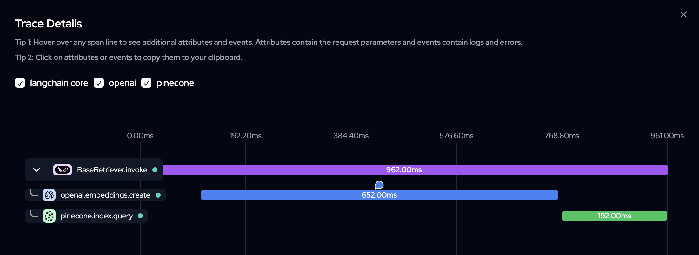

# Research Paper RAG Chatbot
A Retrieval-Augmented Generation (RAG) chatbot built with LangChain, OpenAI, Pinecone, and Flask. This chatbot can process and answer questions about research papers stored in PDF format.

## Features
- PDF document ingestion and processing
- Upload new research papers through the web interface
- Vector storage using Pinecone
- Conversational memory to maintain context
- Web-based chat interface
- Real-time response streaming
- LLM observability and monitoring with Langtrace
- Performance tracking and analytics for LLM interactions

## Prerequisites
- Python 3.8+
- OpenAI API key
- Pinecone API key
- Langtrace API key

## Running Locally with Docker
To run the Research Paper RAG Chatbot locally using Docker, follow these steps:

### Step 1: Pull the Docker Image
First, pull the Docker image from Docker Hub:
```
docker pull mg7609/research-paper-rag-chatbot:latest
```
### Step 2: Create a `.env` File
Generate a flask secret key using:
```
openssl rand -hex 16
```

Create a `.env` file in the root of your project directory and add the following environment variables:
```
FLASK_SECRET_KEY=your_flask_secret_key
OPENAI_API_KEY=your_openai_api_key
PINECONE_API_KEY=your_pinecone_api_key
LANGTRACE_API_KEY=your_langtrace_appi_key
```

### Step 3: Run the Docker Container
Run the Docker container with the following command:
```
docker run --env-file .env -e ENVIRONMENT=Development -p 8000:8000 your-username/research-paper-rag-chatbot:latest
```

### Step 4: Access the Application
Open your web browser and navigate to http://localhost:8000/

## Chatbot Interface


## Langtrace Monitoring Dashboard

