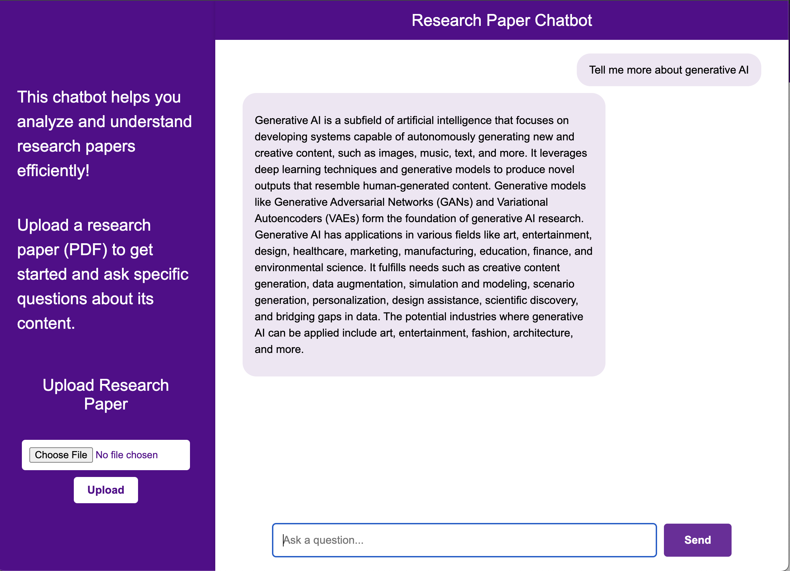

# Research Paper RAG Chatbot

A Retrieval-Augmented Generation (RAG) chatbot built with LangChain, OpenAI, Pinecone, and Flask. This chatbot can process and answer questions about research papers stored in PDF format.

## Features

- PDF document ingestion and processing
- Upload new research papers through the web interface
- Vector storage using Pinecone
- Conversational memory to maintain context
- Web-based chat interface
- Real-time response streaming
- LLM observability and monitoring with Langtrace
- Performance tracking and analytics for LLM interactions

## Prerequisites

- Python 3.8+
- OpenAI API key
- Pinecone API key
- Langtrace API key

## Chatbot Interface

## Langtrace Monitoring Dashboard

